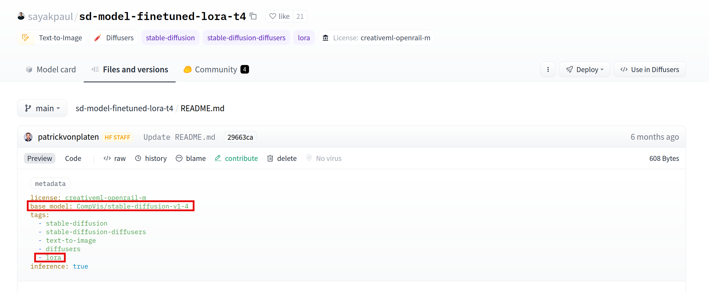

We want to show how one can leverage some features developped in the [Diffusers](https://github.com/huggingface/diffusers/) library to serve many distinct LoRA adapters in a dynamic fashion, with a single service.

We used these features to speed up inference on the Hub for requests related to LoRA adapters based on Diffusion models. In addition to this UX upgrade, this allowed us to mutualize and thus spare compute resources.

To perform inference on a given model, there are two steps: a warm up phase that consists in downloading the model and setting up the service (25s). And the inference job itself (10s). With these improvements we were able to decrease the warm up time from 25s to 3s. So we were able to serve inference for hundreds of distinct LoRA adapters, with less than 5 A10G GPUs, while the user inference requests fell down from 35s to 13.


# LoRA

To understand where the mutualization potential lies, we need to get a really basic understanding of LoRA.

For a more exhaustive presentation on what LoRA is, please refer to the following blog post:

[Using LoRA for Efficient Stable Diffusion Fine-Tuning](https://huggingface.co/blog/lora)

Or refer directly to the [original paper](https://arxiv.org/abs/2106.09685).

LoRA is one of the many existing fine-tuning techniques.

Instead of fine-tuning by performing tiny changes to all the weights of a model checkpoint, we train it by freezing most of its layers and only tuning a few specific ones in the attention blocks. Besides, the weights in these layers are not tuned independently from one another: they are tuned by adding to the original values the result of the product between two smaller matrices (hence the name, LoRA for Lower Rank Adaptation). These matrices are extracted and kept aside, for a later "transplantation"/reload. This trainable weights compose the LoRA adapter.

<div id="diagram"></div>


As an example, in the diagram above the two smaller orange matrices would be kept in the LoRA adapter. Then, later, from the blue base model, you can obtain the adapted yellow one (load the lora adapter), and same in the other direction (unload it).

In other words, it is like an add-on of a base model that can be added and removed on demand. And because of A and B smaller ranks, it is light relatively to the latter size, and loading it should be faster than loading the whole base model.

If you look, for example at the [Stable Diffusion XL Base 1.0](https://huggingface.co/stabilityai/stable-diffusion-xl-base-1.0) model, that is widely used as a base model for many LoRA adapters, you can see that its size on the hub is something like **7GB**. But now if you look at some LoRA adapter there like [this one](https://huggingface.co/minimaxir/sdxl-wrong-lora/), you will see that the adapter's size is only **24 MB** !

There are far less blue base models than there are yellow ones (at least on the Hub). So if we can go quickly from the blue to the yellow one and the other way around, then we have a way serve many distinct yellow models with only a few distinct blue deployments.


# How does it benefit to both the user and the service provider ?

On the Hub, in **6 hours**, we approximately have **130** distinct LoRA adapters requested. The vast majority (**~92%**) of them are adapters based on the [Stable Diffusion XL Base 1.0](https://huggingface.co/stabilityai/stable-diffusion-xl-base-1.0) model. Before this mutualization, this would have meant deploying a dedicated service for all of them (eg. for all the yellow merged matrices in the diagram above), everytime releasing + reserving at least a new GPU. The time to spawn the service and have it ready to serve requests for a specific model is approximately **25s**, then on top of this you have the inference time (**~10s** for a 1024x1024 SDXL inference diffusion with 25 inference steps on an A10G). Then, if an adapter is only occasionally requested, its service gets killed to free resources and gets preempted by others.

So, as a user, if you were requesting for a LoRA adapter that was not so popular, even if it was based on the SDXL model like the vast majority of adapters found on the Hub so far, it would have required **35s** to warm it up and get an answer on the first request (the following ones would have taken the inference time, eg. **10s**).

Now, since all adapters use only a few distinct "blue" base models (like 2 significant ones for diffusion), even if your adapter is not so popular, there is a good chance that its "blue" service is already warmed up. In other words, there is a good chance that you avoid the 25s warm up time, even if you do not request your model that often. The blue model is already downloaded and ready, all we have to do is unload the previous adapter and load the new one, which takes **3s** as we will see [below](#loading-figures). This is why we said in the introduction that the request time fell down from 35s to 13s.

And in the same time, this requires less GPUs to serve all the distinct models (though we already had some way to share GPUs between deployments to maximize their compute usage). More specifically, in a **2 minutes** time frame, there are approximately **10** distinct LoRA adapters that will be requested. Instead of spawning 10 deployments, and keeping them warm for a few minutes, in case the user would be performing more requests, we just serve all of them with 1 or 2 GPUs (or punctually more if there is a request burst)


# Implementation details

We implemented LoRA mutualization on the Hugging Face Inference Api. When a request is performed on a model available in the platform, we first determine whether this is a LoRA adapter or not. Once done, we identify the base model for this adapter and route the request to a common backend farm, able to serve requests for the said model. Inference requests get served by keeping the base model warm and loading/unloading LoRA adapters on the fly. This way, we can then reuse the same compute resources to serve many distinct models at once.

## LoRA adapters structure on the Hub

On the Hub, LoRA adapters can be identified with two attributes:



A LoRA adapter will have a ```base_model``` attribute. This is simply the model which the LoRA adapter was built for and should be applied to when performing inference.

And because LoRA adapters are not the only models with such an attribute (any duplicated model have it too), for a LoRA adapter to be properly identified, it also needs a ```lora``` tag.

So if you want a LoRA adapter to be served as such on the HF Inference Api platform, make sure these attributes are correctly set.

## Loading/Offloading LoRA adapters for Diffusers 🧨

<div class="alert" style="background-color:lightgreen">
<p>
Note that there is a more seemless way to perform the same as what is presented in this section using the <a href="https://github.com/huggingface/peft">peft</a> library. Please refer to <a href="]https://huggingface.co/docs/diffusers/main/en/tutorials/using_peft_for_inference">the documentation</a> for more details. The principle remains the same as below though (going from/to the blue box to/from the yellow one in the <a href="#diagram">diagram</a> above)
</p>
</div>
</br>

4 functions are used in the Diffusers lib to load and unload distinct LoRA adapters:

```load_lora_weights``` and ```fuse_lora``` for loading and merging weights with the main layers. Note that merging weights with the main model before performing inference can decrease the inference time by 30 %.

```unload_lora_weights``` and ```unfuse_lora``` for unloading the adapter.

We provide below an example showing how one can leverage the Diffusers library to quickly load several LoRA adapters on top of a base model

```
import torch


from diffusers import (
    AutoencoderKL,
    DiffusionPipeline,
)

import time

base = "stabilityai/stable-diffusion-xl-base-1.0"

adapter1 = 'nerijs/pixel-art-xl'
weightname1 = 'pixel-art-xl.safetensors'

adapter2 = 'minimaxir/sdxl-wrong-lora'
weightname2 = None

inputs = "elephant"
kwargs = {}

if torch.cuda.is_available():
    kwargs["torch_dtype"] = torch.float16

start = time.time()

vae = AutoencoderKL.from_pretrained(
    "madebyollin/sdxl-vae-fp16-fix",
    torch_dtype=torch.float16,  # load fp16 fix VAE
)
kwargs["vae"] = vae
kwargs["variant"] = "fp16"

model = DiffusionPipeline.from_pretrained(
    base, **kwargs
)

if torch.cuda.is_available():
    model.to("cuda")

elapsed = time.time() - start

print(f"Base model loaded, elapsed {elapsed:.2f} seconds")


def inference(adapter, weightname):

    start = time.time()
    model.load_lora_weights(adapter, weight_name=weightname)*
    # Fusing lora weights with the main layers improves inference time by 30 % !
    model.fuse_lora()
    elapsed = time.time() - start

    print(f"LoRA adapter loaded and fused to main model, elapsed {elapsed:.2f} seconds")

    start = time.time()
    data = model(inputs, num_inference_steps=25).images[0]
    elapsed = time.time() - start
    print(f"Inference time, elapsed {elapsed:.2f} seconds")

    start = time.time()
    model.unfuse_lora()
    model.unload_lora_weights()
    elapsed = time.time() - start
    print(f"LoRA adapter unfused/unloaded from base model, elapsed {elapsed:.2f} seconds")


inference(adapter1, weightname1)
inference(adapter2, weightname2)
```

## Loading figures

All numbers below are in seconds

<table>
  <tr>
    <th>GPU</th>
    <td>T4</td>
    <td>A10G</td>
  </tr>
  <tr>
    <th>Base model loading - not cached</th>
    <td>20</td>
    <td>20</td>
  </tr>
  <tr>
    <th>Base model loading - cached</th>
    <td>5.95</td>
    <td>4.09</td>
  </tr>
  <tr>
    <th>Adapter 1 loading</th>
    <td>3.07</td>
    <td>3.46</td>
  </tr>
  <tr>
    <th>Adapter 1 unloading</th>
    <td>0.52</td>
    <td>0.28</td>
  </tr>
  <tr>
    <th>Adapter 2 loading</th>
    <td>1.44</td>
    <td>2.71</td>
  </tr>
  <tr>
    <th>Adapter 2 unloading</th>
    <td>0.19</td>
    <td>0.13</td>
  </tr>
  <tr>
    <th>Inference time</th>
    <td>20.7</td>
    <td>8.5</td>
  </tr>
</table>

So at the cost of 2 to 4 additional seconds per inference, we can serve many distinct adapters. Note however that on an A10G GPU, the inference time decreases by a lot while the adapters loading time does not change that much, so the LoRA adapters loading/unloading is relatively more expensive.

## Serving inference requests

To serve requests, we use the opensource community image [here](https://github.com/huggingface/api-inference-community/tree/main/docker_images/diffusers)

You can find the previously described mechanism used in the [TextToImagePipeline](https://github.com/huggingface/api-inference-community/blob/main/docker_images/diffusers/app/pipelines/text_to_image.py) class

When a LoRA adapter is requested we look at the one that is loaded, if any, and change it only if required, then we perform inference as usual. This way, with the same service we are able to serve requests for the base model and many distinct adapters.

We show below an example on how you can test and request this image

```
$ git clone https://github.com/huggingface/api-inference-community.git

$ cd api-inference-community/docker_images/diffusers

$ docker build -t test:1.0 -f Dockerfile .

$ cat > /tmp/env_file <<'EOF'
MODEL_ID=stabilityai/stable-diffusion-xl-base-1.0
TASK=text-to-image
HF_HUB_ENABLE_HF_TRANSFER=1
EOF

$docker run --gpus all --rm --name test1 --env-file /tmp/env_file_minimal -p 8888:80 -it test:1.0
```

Then in another terminal perform requests to the base model and/or miscellaneous LoRA adapters to be found on the HF Hub.

```
# Request the base model
$ curl 0:8888 -d '{"inputs": "elephant", "parameters": {"num_inference_steps": 20}}' > /tmp/base.jpg

# Request one adapter
$ curl -H 'lora: minimaxir/sdxl-wrong-lora' 0:8888 -d '{"inputs": "elephant", "parameters": {"num_inference_steps": 20}}' > /tmp/adapter1.jpg

# Request another one
$ curl -H 'lora: nerijs/pixel-art-xl' 0:8888 -d '{"inputs": "elephant", "parameters": {"num_inference_steps": 20}}' > /tmp/adapter2.jpg
```

# Conclusion: benefits for users and hub maintainers

By mutualizing pods on the Inference Api able to serve LoRA adapters for a given base model, we were able to save compute resources while improving the user experience in the same time. Indeed, despite the extra time added by the process of unloading the previously loaded adapter and loading the one we're interested in, the fact that the serving process is most often already up and running made the whole inference time response shorter. This is because models are started/warmed up on demand, causing the first response time to be slower, if you are requesting a model that is not often used.