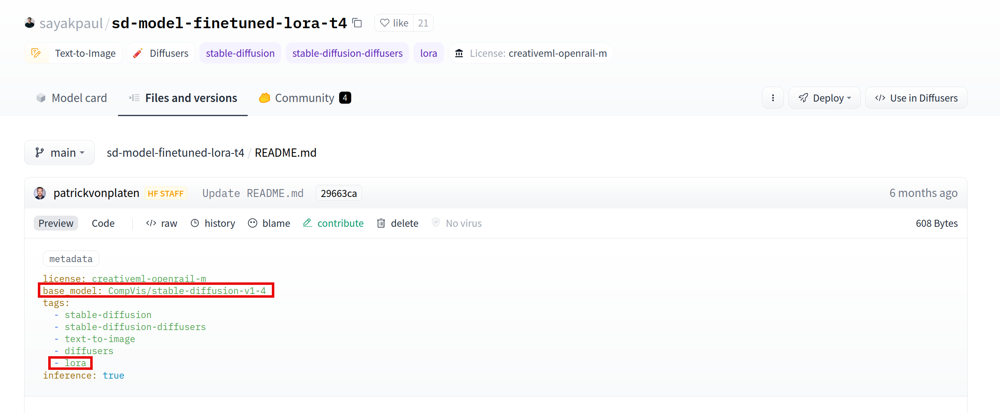

We want to show how one can leverage some features developped in the [Diffusers](https://github.com/huggingface/diffusers/) library to serve many distinct LoRA adapters in a dynamic fashion, with a single service.

We used these features to speed up inference on the Hub for requests related to LoRA adapters based on Diffusion models. In addition to this UX upgrade, this allowed us to mutualize and thus spare compute resources.

# How does it work ?

For a more exhaustive presentation on what LoRA is, please refer to the following blog post:

[Using LoRA for Efficient Stable Diffusion Fine-Tuning](https://huggingface.co/blog/lora)

Or refer directly to the [original paper](https://arxiv.org/abs/2106.09685).

LoRA is one of the many existing fine-tuning techniques.

Instead of fine-tuning by performing tiny changes to all the weights of a model checkpoint, we train it by freezing most of its layers and only tuning a few weights, in specific layers, whose values are extracted and kept aside, for a later "transplantation"/reload. This trainable weights compose the LoRA adapter.

In other words, it is like an add-on of a base model. And because it is light relatively to the latter size, loading it should be faster than loading the whole base model.

# Implementation details

We implemented LoRA mutualization on the Hugging Face Inference Api. When a request is performed on a model available in the platform, we first determine whether this is a LoRA adapter or not. Once done, we identify the base model for this adapter and route the request to a common backend farm, able to serve requests for the said model. Inference requests get served by keeping the base model warm and loading/unloading LoRA adapters on the fly. This way, we can then reuse the same compute resources to serve many distinct models at once.

## LoRA adapters structure on the Hub

On the Hub, LoRA adapters can be identified with two attributes:



A LoRA adapter will have a ```base_model``` attribute. This is simply the model which the LoRA adapter was built for and should be applied to when performing inference.

And because LoRA adapters are not the only models with such an attribute (any duplicated model have it too), for a LoRA adapter to be properly identified, it also needs a ```lora``` tag.

So if you want a LoRA adapter to be served as such on the HF Inference Api platform, make sure these attributes are correctly set.

## Loading/Offloading LoRA adapters for Diffusers 🧨

4 functions are used in the Diffusers lib to load and unload distinct LoRA adapters:

```load_lora_weights``` and ```fuse_lora``` for loading and merging weights with the main layers. Note that merging weights with the main model before performing inference can decrease the inference time by 30 %.

```unload_lora_weights``` and ```unfuse_lora``` for unloading the adapter.

We provide below an example showing how one can leverage the Diffusers library to quickly load several LoRA adapters on top of a base model

```
import torch


from diffusers import (
    AutoencoderKL,
    DiffusionPipeline,
)

import time

base = "stabilityai/stable-diffusion-xl-base-1.0"

adapter1 = 'nerijs/pixel-art-xl'
weightname1 = 'pixel-art-xl.safetensors'

adapter2 = 'minimaxir/sdxl-wrong-lora'
weightname2 = None

inputs = "elephant"
kwargs = {}

if torch.cuda.is_available():
    kwargs["torch_dtype"] = torch.float16

start = time.time()

vae = AutoencoderKL.from_pretrained(
    "madebyollin/sdxl-vae-fp16-fix",
    torch_dtype=torch.float16,  # load fp16 fix VAE
)
kwargs["vae"] = vae
kwargs["variant"] = "fp16"

model = DiffusionPipeline.from_pretrained(
    base, **kwargs
)

if torch.cuda.is_available():
    model.to("cuda")

elapsed = time.time() - start

print(f"Base model loaded, elapsed {elapsed:.2f} seconds")


def inference(adapter, weightname):

    start = time.time()
    model.load_lora_weights(adapter, weight_name=weightname)*
    # Fusing lora weights with the main layers improves inference time by 30 % !
    model.fuse_lora()
    elapsed = time.time() - start

    print(f"LoRA adapter loaded and fused to main model, elapsed {elapsed:.2f} seconds")

    start = time.time()
    data = model(inputs, num_inference_steps=25).images[0]
    elapsed = time.time() - start
    print(f"Inference time, elapsed {elapsed:.2f} seconds")

    start = time.time()
    model.unfuse_lora()
    model.unload_lora_weights()
    elapsed = time.time() - start
    print(f"LoRA adapter unfused/unloaded from base model, elapsed {elapsed:.2f} seconds")


inference(adapter1, weightname1)
inference(adapter2, weightname2)
```

Results:

All numbers below are in seconds

<table>
  <tr>
    <th>GPU</th>
    <td>T4</td>
    <td>A10G</td>
  </tr>
  <tr>
    <th>Base model loading - not cached</th>
    <td>20</td>
    <td>20</td>
  </tr>
  <tr>
    <th>Base model loading - cached</th>
    <td>5.95</td>
    <td>4.09</td>
  </tr>
  <tr>
    <th>Adapter 1 loading</th>
    <td>3.07</td>
    <td>3.46</td>
  </tr>
  <tr>
    <th>Adapter 1 unloading</th>
    <td>0.52</td>
    <td>0.28</td>
  </tr>
  <tr>
    <th>Adapter 2 loading</th>
    <td>1.44</td>
    <td>2.71</td>
  </tr>
  <tr>
    <th>Adapter 2 unloading</th>
    <td>0.19</td>
    <td>0.13</td>
  </tr>
  <tr>
    <th>Inference time</th>
    <td>20.7</td>
    <td>8.5</td>
  </tr>
</table>

So at the cost of 2 to 4 additional seconds per inference, we can serve many distinct adapters. Note however that on an A10G GPU, the inference time decreases by a lot while the adapters loading time does not change that much, so the LoRA adapters loading/unloading is relatively more expensive.

# Serving inference requests

To serve requests, we use the opensource community image [here](https://github.com/huggingface/api-inference-community/tree/main/docker_images/diffusers)

You can find the previously described mechanism used in the [TextToImagePipeline](https://github.com/huggingface/api-inference-community/blob/main/docker_images/diffusers/app/pipelines/text_to_image.py) class

When a LoRA adapter is requested we look at the one that is loaded, if any, and change it only if required, then we perform inference as usual. This way, with the same service we are able to serve requests for the base model and many distinct adapters.

We show below an example on how you can test and request this image

```
$ git clone https://github.com/huggingface/api-inference-community.git

$ cd api-inference-community/docker_images/diffusers

$ docker build -t test:1.0 -f Dockerfile .

$ cat > /tmp/env_file <<'EOF'
MODEL_ID=stabilityai/stable-diffusion-xl-base-1.0
TASK=text-to-image
HF_HUB_ENABLE_HF_TRANSFER=1
EOF

$docker run --gpus all --rm --name test1 --env-file /tmp/env_file_minimal -p 8888:80 -it test:1.0
```

Then in another terminal perform requests to the base model and/or miscellaneous LoRA adapters to be found on the HF Hub.

```
# Request the base model
$ curl 0:8888 -d '{"inputs": "elephant", "parameters": {"num_inference_steps": 20}}' > /tmp/base.jpg

# Request one adapter
$ curl -H 'lora: minimaxir/sdxl-wrong-lora' 0:8888 -d '{"inputs": "elephant", "parameters": {"num_inference_steps": 20}}' > /tmp/adapter1.jpg

# Request another one
$ curl -H 'lora: nerijs/pixel-art-xl' 0:8888 -d '{"inputs": "elephant", "parameters": {"num_inference_steps": 20}}' > /tmp/adapter2.jpg
```

# Conclusion: win-win situation

By mutualizing pods on the Inference Api able to serve LoRA adapters for a given base model, we were able to save compute resources while improving the user experience in the same time. Indeed, despite the extra time added by the process of unloading the previously loaded adapter and loading the one we're interested in, the fact that the serving process is most often already up and running made the whole inference time response far shorter. On classical model models are started/warmed up on the first request, causing the response time to be slower if you are asking for a model that is not requested that often.